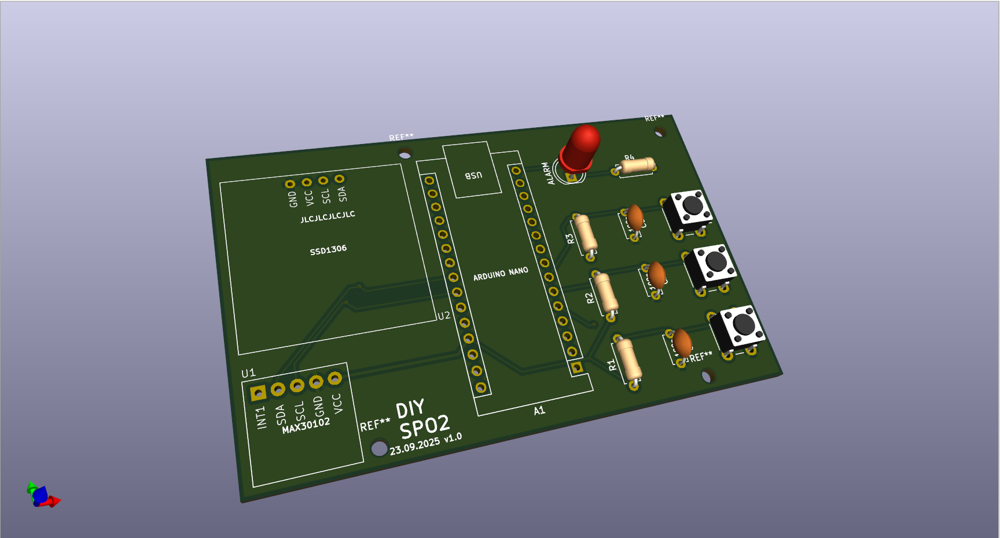
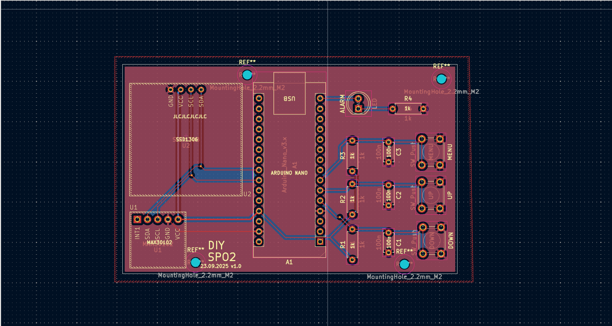

# MAX30102 Heart Rate and SpO2 Monitor PCB Design

This repository contains my KiCad PCB design project for a MAX30102-based heart rate and SpO2 monitoring system.

The project was designed as a compact embedded system board using an Arduino Nano, MAX30102 pulse oximeter sensor, SSD1306 OLED display, user buttons, and alarm indicator components.

---

## Project Overview

The main purpose of this project was to design a PCB for a basic biomedical signal monitoring application.

The system uses the MAX30102 sensor module to detect pulse-related optical signals. An Arduino Nano processes the sensor data and displays the measured values on an SSD1306 OLED screen.

The board also includes buttons for user interaction and an alarm LED section for visual warning or status indication.

---

## 3D PCB View

The 3D view shows the physical placement of the main components, including the Arduino Nano, MAX30102 sensor module, SSD1306 OLED display, buttons, resistors, capacitors, and alarm LED.

---

## PCB Layout

The PCB layout was created in KiCad.  
The board includes separated sections for the sensor module, OLED display, Arduino Nano, control buttons, and alarm indicator.

---

## Main Components

- Arduino Nano
- MAX30102 heart rate and SpO2 sensor module
- SSD1306 OLED display
- Push buttons
- Alarm LED
- Resistors
- Capacitors
- I2C communication lines
- Mounting holes

---

## Working Principle

The MAX30102 sensor works by using red and infrared light to measure changes in blood flow. These optical signals can be used to estimate heart rate and blood oxygen saturation.

The Arduino Nano communicates with the MAX30102 sensor over I2C. It reads the sensor data, processes the measurements, and sends the results to the SSD1306 OLED display.

The push buttons can be used for menu control, navigation, or user input. The alarm LED can be used as a warning indicator when a defined threshold or condition is detected.

---

## PCB Design Notes

- The MAX30102 and SSD1306 modules use I2C communication.
- Arduino Nano was placed near the center for easy routing.
- Buttons were placed on the right side for user interaction.
- The alarm LED was placed at the top-right side for visibility.
- Mounting holes were added for mechanical fixing.
- The board was checked using KiCad 3D Viewer.

---

## What I Learned

Through this project, I gained practical experience in:

- Designing sensor-based embedded system PCBs
- Using KiCad for PCB layout and 3D visualization
- Working with I2C-based modules
- Integrating MAX30102 and SSD1306 modules
- Designing user interface buttons on PCB
- Creating a compact health-monitoring prototype board
- Organizing PCB sections for readability and functionality

---

## Tools and Technologies

- KiCad
- Arduino Nano
- MAX30102
- SSD1306 OLED Display
- I2C Communication
- PCB Design
- Embedded Systems
- Biomedical Sensor Applications

---

## Note

This project is an educational prototype and is not intended to be used as a medical device.

---

## Author

**Talha Üzümcü**  
Electrical and Electronics Engineer  
GitHub: [talhazmc](https://github.com/talhazmc)
